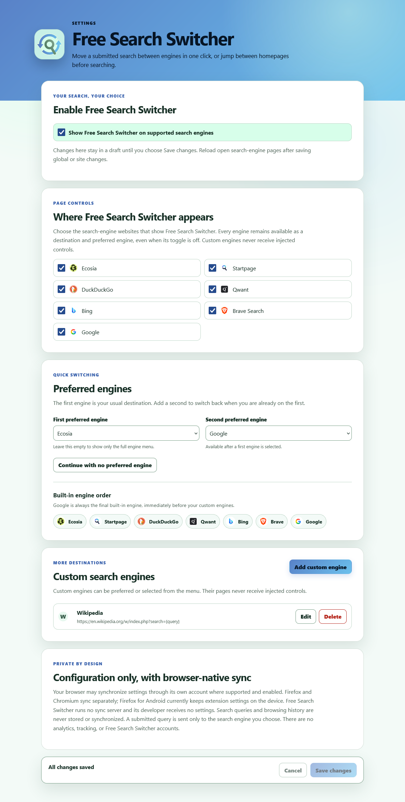
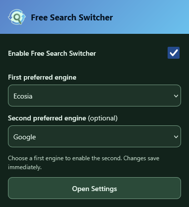
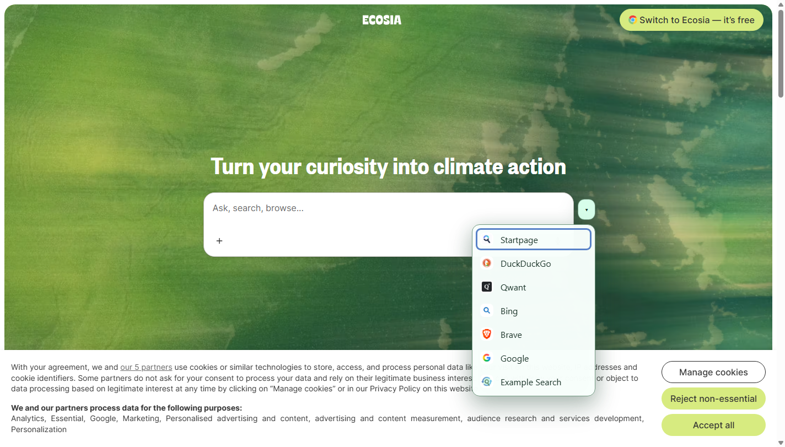

# Free Search Switcher

Free Search Switcher **2.0.0** is a Firefox-first extension for switching between preferred and custom search engines while preserving the current submitted search query. Firefox Desktop is the primary target, Firefox for Android remains fully supported, and Chromium is the secondary compatibility target. One Vanilla JavaScript WXT codebase produces both Manifest V3 packages.

Read the [official documentation](https://freesearchswitcher-docs.captainratax.com/) for installation, usage, settings, and privacy information.

## Screenshots

### Settings and onboarding



*The full Settings page keeps changes in a draft until Save changes. Cancel restores the saved configuration.*

### Desktop popup



*Popup changes save immediately. A supported page offers Reload page when its applied state needs to change.*

### Search-page controls



## Features

- Adds an isolated, compact quick-switch control beside supported search bars.
- Works on both homepages and search-results pages.
- Transfers only a submitted textual query. Text typed after page load but not submitted is never transferred.
- Preserves the current search mode (Images, Videos, News, Maps, Shopping) when the destination engine has a verified equivalent, and otherwise falls back to a normal web search. See "Search mode preservation".
- Supports zero, one, or two preferred engines with predictable quick-switch behavior.
- Provides a complete ordered engine menu with accessible keyboard operation.
- Supports custom engines as navigation targets with optional HTTPS icon URLs and first-letter fallback.
- Offers global and per-site injection switches without removing search destinations.
- Provides a desktop popup for immediate global/preference changes and page-load-aware reload feedback.
- Keeps full Settings edits in a draft until Save changes; Cancel restores persisted configuration.
- Uses browser-native configuration sync where supported, with no developer-operated sync service.
- Uses a closed Shadow DOM, bundled built-in icons, and safe DOM construction.
- Recovers when a supported site replaces or changes its search bar.
- Updates an already-running UI when preferences or custom engines change; global/site eligibility applies on page load.
- Supports light, dark, forced-colors, and responsive layouts.
- Contains no analytics, telemetry, tracking, accounts, developer servers, remote executable code, query logs, or browsing-history collection.

## Supported browsers

- **Firefox Desktop 140 or newer:** primary target, with the desktop popup and full Settings.
- **Firefox for Android 142 or newer:** fully supported using the same Firefox package, touch layouts, and full Settings. Its action provides simple Settings access.
- **Chrome and Chromium-based browsers, including Brave:** secondary compatibility target.

Previous-release automated live integration suites were run against Brave 152 and Firefox 155 on Windows. Mobile layouts were inspected with Android-sized touch viewports and a Firefox Android user agent, and the packaged Firefox Manifest V3 build passed a mobile-layout WebDriver smoke test. A final physical-device Firefox for Android check is still recommended before enabling broad AMO distribution. Both Firefox variants use the same packaged build.

## Supported built-in search engines

Built-in engines always use this order. Google is the final built-in engine and appears immediately before custom engines in ordinary built-in/custom lists.

| Order | Engine | Home URL | Search URL | Submitted query source |
| ---: | --- | --- | --- | --- |
| 1 | Ecosia | `https://www.ecosia.org/` | `https://www.ecosia.org/search?q={query}` | URL parameter `q` |
| 2 | Startpage | `https://www.startpage.com/` | `https://www.startpage.com/sp/search?query={query}` | URL parameter `query`; submitted hidden results metadata for POST results |
| 3 | DuckDuckGo | `https://duckduckgo.com/` | `https://duckduckgo.com/?q={query}` | URL parameter `q` |
| 4 | Qwant | `https://www.qwant.com/` | `https://www.qwant.com/?q={query}` | URL parameter `q` |
| 5 | Bing | `https://www.bing.com/` | `https://www.bing.com/search?q={query}` | URL parameter `q` |
| 6 | Brave | `https://search.brave.com/` | `https://search.brave.com/search?q={query}` | URL parameter `q` |
| 7 | Google | `https://www.google.com/` | `https://www.google.com/search?q={query}` | URL parameter `q` |

All canonical URLs above were opened successfully during implementation. Startpage currently submits its homepage form with POST and can land on `/sp/search` without a URL query. Its adapter therefore prefers the canonical `query` parameter, then reads non-editable submitted-query hidden fields on the results page. It never treats the editable visible input as proof of submission. The canonical Startpage URL remains valid and was not changed.

Search engines may normalize the destination URL or add their own session parameters after navigation. Free Search Switcher transfers only the textual query and the normalized search mode described below, and intentionally ignores result filters, pagination, SafeSearch, dates, regions, and other engine-specific parameters.

## Search mode preservation

When the current page represents a submitted search in Images, Videos, News, Maps, or Shopping mode, switching engines opens the same mode on the destination whenever that destination has a stable, verified equivalent. For example, Google Images results for "red flowers" switch to Ecosia Images results for "red flowers". If the destination has no verified equivalent for the current mode, Free Search Switcher falls back to a normal web search on that destination, exactly as it always has &mdash; for instance, switching from Google Maps to Ecosia, which has no Maps vertical of its own. Filters, pagination, SafeSearch, dates, and region settings are never transferred, only the textual query and the mode itself.

Mode detection reads the current page's URL (query parameters or path segments, depending on the engine) so it works immediately after a client-side navigation or mode change, without ever transferring text that was typed but not submitted. If there is no submitted query, switching opens the destination's dedicated homepage for that mode when one is confirmed stable, or the destination's normal homepage otherwise &mdash; never an empty search. Custom search engines only ever have their single general search template, so they always receive the plain web fallback regardless of the source mode. Any mode that is not recognized, or not one of the six normalized modes below, is treated as a normal web search.

### Mode compatibility matrix

Every URL below was opened directly (no referrer, freshly constructed) during implementation using a JavaScript-enabled browser (Playwright driving Brave over the DevTools protocol), not guessed from documentation. "Mode home" marks a destination confirmed to have a dedicated, stable homepage for that mode when there is no submitted query; where it says "engine home", switching with no query opens the destination's normal homepage instead, which is expected, spec-compliant behavior, not a defect.

| Engine | Web | Images | Videos | News | Maps | Shopping |
| --- | --- | --- | --- | --- | --- | --- |
| Ecosia | Yes | Yes &ndash; `/images?q=` [1] | Yes &ndash; `/videos?q=` [1] | Yes &ndash; `/news?q=` [1] | No [2] | No [1] |
| Startpage | Yes | Yes &ndash; `cat=images` (engine home) | Yes &ndash; `cat=video` (engine home) [6] | Yes &ndash; `cat=news` (engine home) | No [3] | No |
| DuckDuckGo | Yes | Yes &ndash; `ia=images&iax=images` (engine home) | Yes &ndash; `ia=videos&iax=videos` (engine home) | Yes &ndash; `ia=news&iar=news` (engine home) | Yes &ndash; `iaxm=maps` (engine home) [4] | No |
| Qwant | Yes | Yes &ndash; `t=images` (engine home) | Yes &ndash; `t=videos` (engine home) | Yes &ndash; `t=news` (engine home) | No | No |
| Bing | Yes | Yes &ndash; `/images/search?q=` (mode home: `/images`) | Yes &ndash; `/videos/search?q=` (mode home: `/videos`) | Yes &ndash; `/news/search?q=` (mode home: `/news`) | Yes &ndash; `/maps?q=` (mode home: `/maps`) | Yes &ndash; `/shop/topics?q=` (engine home) |
| Brave | Yes | Yes &ndash; `/images?q=` (engine home) | Yes &ndash; `/videos?q=` (engine home) | Yes &ndash; `/news?q=` (engine home) | Yes &ndash; `/maps/search?q=` (mode home: `/maps/search`) | No |
| Google | Yes | Yes &ndash; `udm=2` (mode home: `/imghp`) | Yes &ndash; `udm=7` (engine home) | Yes &ndash; `tbm=nws` (engine home) | Yes &ndash; `/maps/search/{query}` (mode home: `/maps`) [5] | Yes &ndash; `udm=3` (engine home) |

[1] Ecosia's Images/Videos/News verticals were confirmed live once past its Cloudflare check (four earlier, independent, fully automated attempts &mdash; a cold Playwright/CDP request, an organic homepage-then-search Playwright/CDP flow, `WebFetch`, and a plain `fetch()` with a real browser user agent &mdash; were all blocked; see "Known limitations"). A bare `/images`, `/videos`, or `/news` request with no query returns Ecosia's own 404 page, so none of the three has a dedicated mode homepage; the plain Ecosia homepage is used instead when there is no submitted query. Ecosia has no Shopping tab; it shows only an inline product carousel inside Images results.

[2] Ecosia's "Maps" entry is an external link to Google Maps (`google.com/maps/search/?api=1&query=...`), a different domain entirely, not a same-origin Ecosia destination, so it is not offered.

[3] A live `cat=maps` request returned Startpage's own error page (`/en/errors/?t=device`) rather than a maps view, so Maps is not offered on Startpage. Startpage has no Shopping tab.

[4] DuckDuckGo's "Maps" results are a same-origin local-business-listings panel (similar to Yelp-style results), not an embedded map or an external redirect, so it is treated as a supported destination. Its rendering varied between inspection sessions (an inline listings panel in some runs, a dedicated map-app shell in others); the switcher control does not reliably mount on the dedicated-map-app rendering, so DuckDuckGo Maps could not be included as a *source* in the live integration suite, only as a destination (mode construction and detection are still covered by the unit test matrix).

[5] Google Maps embeds the query in the URL path (`/maps/search/{query}`) instead of a `q` parameter; the Google adapter decodes it separately for query extraction. Google was also observed, live and only under a mobile/Firefox-Android user agent, to redirect `udm=2`/`udm=7` to the legacy `tbm=isch`/`tbm=vid` parameters instead; detection recognizes both forms. Shopping (`udm=3`) has no such legacy equivalent and is dropped to a plain web search by Google itself for that user agent &mdash; detection correctly reports the page actually served.

[6] Startpage's category parameter is inconsistently named: plural for `cat=images`, invariant for `cat=news`, but **singular** for Videos (`cat=video`, not `cat=videos`). The plural form was initially and incorrectly assumed here; it does not error, it silently returns the same "All" web results (visible only from the inactive Videos tab and an unlabeled "Web results" heading, not from an error page or a different image/result count), which is why it first passed non-visual automated verification. Re-confirmed live with the corrected singular form, including a full Unicode round trip.

All seven engines confirmed to work with a minimal, directly-constructed URL (just the query and the mode parameter, no session cookies, referrer, or tracking parameters such as Bing's `FORM=`, Brave's `source=web`, or Google's `sei=`), which matches how this extension navigates. Unicode, accents, spaces, quotes, ampersands, and search operators were verified end-to-end for every mode above using the query `café pesquisa` with no referrer.

### Where the switcher control is available on mode pages

The seven static content-script origins already cover every verified mode URL above (all of them share the same hostname as the engine's normal web results, including `google.com/maps/...`, `bing.com/maps`, and `search.brave.com/maps/search`), so **no new permissions or origins were needed for mode preservation**. The switcher control was confirmed, using the same live-browser method, to still mount correctly on every Images/Videos/News/Shopping results page, on Google Maps, and on every confirmed mode homepage. It does not mount on Bing Maps, Brave Search Maps, or DuckDuckGo's local-listings Maps panel: those are distinct, dedicated map interfaces with their own search-box markup rather than the shared search header the other pages reuse. Mode-preserving navigation *to* those pages still works; only the in-page quick-switch control on that specific page is unavailable there, exactly as it is already unavailable on consent and anti-automation challenge pages.

### Why switching away from Startpage's own Images/Videos/News tabs does not preserve mode

This is the one case in the compatibility matrix above where mode preservation is known to not work, and it is a permanent limitation of Startpage's own page, not a bug in this extension.

**Example of the gap:** search on Startpage, then click Startpage's *own* "Videos" tab (not through this extension). The page now visibly shows Startpage's video results. Now use Free Search Switcher to switch to, say, Bing. Instead of landing on Bing's video results, it lands on Bing's normal web results for the same query.

**Why:** every other engine in this project signals its current mode through the page URL &mdash; a query parameter or a path segment &mdash; which is exactly what `detectMode` in each adapter reads (see "Built-in engine adapters" above). Startpage is different: its Images/Videos/News/Maps tabs are not links. Live inspection of the tab markup found each one is its own hidden-field HTML form (`<form method="post" action="/sp/search">`) carrying its own `cat`, `query`, and session-code fields, all posting to the same `/sp/search` address. Clicking a tab submits that form client-side and swaps the results in place; **the address bar never changes**, so there is no URL for `detectMode` to read the new mode from, no matter when or how it looks.

The natural next question is whether the *page content* reveals the active tab instead. It does, but not in a usable way: inspecting the tab elements live turned up no `aria-current`, `aria-selected`, or `data-*` state attribute distinguishing the active tab from the other four &mdash; the only difference found was a single CSS class name generated by Startpage's own build tooling (e.g. `css-1kp07uo`), which carries no semantic meaning and is reassigned to whichever tab is active. Every adapter in this project deliberately avoids exactly this kind of signal for detection (see "Built-in engine adapters": "prefer stable roles, form actions, input names, IDs, and `data-testid` attributes... generated classes are not required") precisely because it is an internal implementation detail of the site's build output, not a published contract, and can change on any redeploy without notice. Building mode detection on it here would be the one exception to that rule in the whole codebase, and it could silently start reporting the wrong mode &mdash; or stop working entirely &mdash; the next time Startpage ships a new build, with no way for this project to detect or warn about the change.

**What still works:** mode is preserved correctly in every other direction involving Startpage &mdash; switching *from* Startpage when it was reached through a URL that already carries `cat=` (including one this extension itself constructed), and switching *to* Startpage's Images/Videos/News from any other engine (both are covered by the live integration suite). Only continued use of Startpage's own in-page tabs, after landing on the page, falls outside what URL-based detection can see.

## Preferred engines

The first preferred engine is the normal quick-switch destination. The second preferred engine is optional and cannot exist without the first.

- With no preferred engine, supported pages show only the complete-menu arrow.
- With one preferred engine, that engine shows only the arrow; every other supported engine shows a quick button targeting the first preference plus the arrow.
- With two preferred engines, the first engine targets the second, while the second and every other supported engine target the first.
- Either preference can be a custom engine.
- The same engine cannot occupy both preferred slots.
- Clearing the first preference also clears the second.

The complete menu starts with the first and second preferences when configured, removes duplicates and the current engine, then lists the remaining built-ins in the order above, followed by custom engines in creation order. Preferred entries are labelled in the menu.

## Custom search engines

Each custom engine contains a stable generated ID, display name, HTTPS homepage, HTTPS search template, optional HTTPS `iconUrl` string, and creation order.

A valid search template must contain exactly one literal `{query}` placeholder after the URL hostname. For example:

```text
https://example.com/search?q={query}
```

The extension rejects invalid URLs, non-HTTPS navigation, credentials in URLs, missing or repeated placeholders, placeholders in the hostname, invalid icon URLs, and dangerous schemes such as `javascript:`, `data:`, `file:`, and browser-internal URLs.

Enter an optional **Icon URL**, such as `https://example.com/icon.png`. Validation checks HTTPS URL syntax without fetching an image. Only the URL string is stored; there is no upload, canvas conversion, or image proxy. When an icon is displayed, the browser may contact its external image host. Missing, invalid, or failed images fall back to the engine's first letter without breaking navigation. Custom additions, edits, and deletions remain in the Settings draft until the page-level **Save changes**.

Custom engines are navigation targets only. Their websites do not receive injected controls or host access. Deleting a selected custom engine clears the affected preference slots according to the preference invariants.

## Settings, sync, and upgrades

The desktop popup saves global enabled state and preferred engines immediately. It compares the supported page's state at load with saved settings to offer **Reload page** only when required. Toggle off then back on before reloading and the warning clears. Unsupported websites do not show it.

Full Settings keeps a baseline and a draft. Global/site switches, preferences, custom add/edit/delete, and icon URLs persist together only on **Save changes**. **Cancel** restores saved values. Clean Settings tabs refresh on external changes; dirty tabs keep edits and show a warning with a reset action. Unsaved drafts trigger a normal browser leave-page warning where supported.

All seven site switches and the global switch default on. They control injection at page load; saving them does not create/remove controls on an existing page. Reload to apply them. Disabling Google injection still leaves Google as a destination and preferred-engine choice. Custom sites never gain injected controls.

Schema version 2 uses `storage.sync` for configuration only: switches, preferred IDs, ordered custom definitions and icon URL strings, and schema metadata. Firefox Desktop can use Mozilla sync; Chromium can use its browser's supported service. These ecosystems remain separate. Firefox for Android does not synchronize extension data with Desktop Firefox through Mozilla accounts. See [MDN storage.sync](https://developer.mozilla.org/en-US/docs/Mozilla/Add-ons/WebExtensions/API/storage/sync). Local fallback keeps settings usable when sync storage is unavailable.

Migration reads the legacy local record, preserves preferences/custom engines/order, defaults new switches to enabled, and drops old uploaded icon data while retaining its engine. Existing valid v2 configuration takes precedence. Legacy cleanup follows a successful migration; the process is idempotent.

## Privacy

See the complete [Privacy Policy](PRIVACY.md), effective September 18, 2026.

The developer receives no settings or searches and operates no sync server or icon proxy. Browser providers may synchronize configuration through the user's browser account; external icon hosts may receive browser image requests. Only a user-selected destination receives the submitted query through direct HTTPS navigation.

The onboarding marker `freeSearchSwitcherOnboardingOpened` remains in `storage.local`. Queries, current URLs, history, modes, popup state, reload warnings, and Options drafts are never synchronized. Queries and current URLs are never written to either storage area or logs. There are no analytics, telemetry, tracking, ads, accounts, or developer cloud services.

The injected UI uses a closed Shadow DOM to isolate its controls and styles from the search page.

## Permissions

Production builds request only the `storage` API permission.

| Permission or access | Why it is required |
| --- | --- |
| `storage` | Saves configuration with browser-native sync, supports migration/local fallback, and retains the onboarding marker locally. Change events update active interfaces. |
| Static content-script access to the seven HTTPS origins below | Detects the supported engine, locates its search bar, and injects the switching controls. |
| Web-accessible bundled engine PNGs on those same seven origins | Lets the closed content UI display local engine icons without hotlinking or broad host access. |
| Firefox `searchTerms` data-collection declaration | Tells Firefox that a submitted query is sent directly to the search engine explicitly selected by the user. The developer never receives it, and it is not retained by the extension. |

The exact static origins are:

```text
https://www.ecosia.org/*
https://www.startpage.com/*
https://duckduckgo.com/*
https://www.qwant.com/*
https://www.bing.com/*
https://search.brave.com/*
https://www.google.com/*
```

Production manifests do not request `<all_urls>`, arbitrary HTTP/HTTPS access, custom-engine domains, `tabs`, `scripting`, history, bookmarks, cookies, web requests, downloads, clipboard access, or any other API permission. WXT may add development-only permissions for hot reload; always audit the production manifests under `.output/chrome-mv3/` and `.output/firefox-mv3/`.

## Prerequisites

- Node.js 22.13 or newer
- npm
- Firefox for Firefox development and temporary installation
- For Android development: Firefox for Android 142 or newer, an Android device with USB debugging enabled, and Android SDK Platform Tools (`adb`)
- A Chrome-family browser for Chromium development or Brave integration checks

## Install development dependencies

```sh
npm install
```

The lockfile pins WXT 0.21.4 and the small JavaScript-only development toolchain used by this release. No TypeScript package or configuration is required.

## Development commands

| Command | Purpose |
| --- | --- |
| `npm run dev:firefox` | Start WXT development for Firefox Manifest V3. |
| `npm run dev:firefox-android` | Build Firefox MV3 and install/run it on a connected Firefox for Android device through `web-ext`. |
| `npm run dev` | Start WXT development for Chrome/Chromium Manifest V3. |
| `npm run lint` | Run ESLint over JavaScript source and tests. |
| `npm test` | Run Vitest unit and DOM behavior tests. |
| `npm run test:v2` | Run the packaged Chromium extension against synthetic supported pages for deterministic v2 UI flows. |
| `npm run test:popup:firefox` | Click the actual Firefox toolbar action and check native popup sizing in light/dark modes. |
| `npm run test:popup:chromium` | Open the native Brave/Chromium action panel and check sizing, reload warnings, and reachable controls. |
| `npm run test:integration` | Launch the Chromium production build in Brave and run live browser checks. |
| `npm run test:mobile` | Run the live Brave suite with Android-sized touch viewports and a Firefox Android user agent. |
| `npm run test:firefox` | Temporarily install the packaged MV3 build in Firefox and run a WebDriver smoke test. |
| `npm run test:firefox:mobile` | Run the packaged Firefox smoke test with a mobile viewport and Firefox Android user agent. |
| `npm run lint:firefox` | Validate the generated Firefox extension with `web-ext lint`. |

The integration command expects Brave at its standard Windows installation path. Set `FSS_BROWSER_PATH` to another Chromium-family executable when needed. Set `FSS_CAPTURE_SCREENSHOTS=1` to refresh the screenshots under `docs/screenshots/`.

The Firefox smoke command expects `FSS_FIREFOX_PATH` and `FSS_GECKODRIVER_PATH` to point to Firefox and geckodriver. Its default `.output/free-search-switcher-<package version>-firefox.zip` path derives from `package.json`; run `npm run zip:firefox` first after changes.

## Build and package

```sh
# Firefox Manifest V3
npm run build:firefox
npm run zip:firefox

# Chromium Manifest V3
npm run build
npm run zip
```

Production directories:

```text
.output/firefox-mv3/
.output/chrome-mv3/
```

WXT writes packaged ZIP files under `.output/`. Firefox packaging also creates a source ZIP for review/signing workflows.

## Load the unpacked Chromium build

1. Run `npm run build`.
2. Open `chrome://extensions` in Chrome or `brave://extensions` in Brave.
3. Enable **Developer mode**.
4. Choose **Load unpacked**.
5. Select `.output/chrome-mv3/`.
6. The settings page opens once on first install. Use **Open Settings** in the desktop toolbar popup to reopen it.

## Run or temporarily install the Firefox build

For development with WXT and `web-ext`:

```sh
npm run dev:firefox
```

For a built temporary extension:

1. Run `npm run build:firefox`.
2. Open `about:debugging#/runtime/this-firefox`.
3. Select **Load Temporary Add-on**.
4. Choose `.output/firefox-mv3/manifest.json`.

Temporary add-ons are removed when Firefox exits. Use the generated Firefox ZIP for signing or distribution workflows.

## Run on Firefox for Android

Firefox for Android uses the same Manifest V3 ZIP as desktop Firefox. The manifest declares Android compatibility from Firefox 142 onward so Firefox can show its built-in search-term data-consent prompt.

1. Install Firefox for Android 142 or newer on a physical device.
2. Enable Android developer options and USB debugging, install Android SDK Platform Tools, and confirm the device appears with `adb devices`.
3. From the repository, run:

   ```sh
   npm run dev:firefox-android
   ```

   The script targets the release package `org.mozilla.firefox`. If a different Firefox channel is installed, run the equivalent `web-ext run` command with that channel's package name.
4. Approve the temporary installation and the declared access on the device.
5. Open a supported search engine. The extension action is available from Firefox's browser menu under **Add-ons**; selecting Free Search Switcher provides access to the full Settings page.

Temporary Android installation requires a connected device. AMO-signed builds can be installed normally without the development connection.

## Architecture

```text
entrypoints/
  background.js          Local first-install onboarding
  content.js             Supported-origin content-script bootstrap
  popup/                 Immediate desktop controls and page-load reload feedback
  options/               Full draft-based Settings, Save/Cancel, custom URL editor
utils/
  engines.js             Canonical metadata, ordering, quick-target rules, and per-engine mode capability
  modes.js               Canonical normalized search-mode identifiers
  navigation.js          Submitted-query extraction and encoded, mode-aware target URLs
  settings.js            Schema v2, enabled/site defaults, preference/custom invariants
  storage.js             Normalized browser storage wrapper
  settings-storage.js    Sync chunks, quota checks, migration/fallback, change events
  validation.js          HTTPS, template, and optional icon URL validation
  adapters/              One semantic DOM adapter per built-in engine, including mode detection
ui/
  search-switcher-ui.js  Closed-Shadow-DOM controls and dynamic recovery
public/
  engine-icons/          Locally bundled runtime engine icons
  icons/                 Extension icon sizes
assets/                  Replaceable source icon assets
tests/                   JavaScript unit and DOM behavior coverage
scripts/
  v2-smoke.js            Deterministic packaged Chromium v2 UI flows
  integration-smoke.js   Live Brave production-build integration suite
  mobile-integration-smoke.js  Android-layout Brave suite launcher
  firefox-smoke.js       Packaged Firefox MV3 WebDriver smoke suite
  firefox-mobile-smoke.js  Mobile-layout Firefox smoke launcher
```

The background opens Settings on first installation using a local onboarding marker. The desktop toolbar action opens a WXT popup whose **Open Settings** button uses `runtime.openOptionsPage()`. On Android the action provides simple full-Settings access. No broad `tabs` permission is required.

The content entrypoint exists only on seven supported origins. It detects the adapter and loads normalized settings, then takes a page-load snapshot of the global and current-site switches. Only eligible pages start `SearchSwitcherUi`; later eligibility changes require reload. Runtime messaging lets the popup inspect that snapshot even when UI is disabled. Storage events still update preferences and custom destinations in a running UI. Existing DOM/URL/viewport observers continue recovering from site layout changes. See [architecture](docs/development/architecture.md) for storage chunks, quota limits, migration, and fallback details.

The control is positioned immediately adjacent to the compact visual search-bar container selected by the adapter. Desktop placement chooses the right or left side when space exists. At phone widths, the UI uses 48-pixel minimum touch targets and reserves engine-safe space so native input, microphone, image, submit, tab, and filter controls remain reachable. Ecosia and Google results use inert, non-form inline spacers between the editable query field and native trailing actions; Startpage results and the Google homepage use stable outer flow containers; Qwant results use the free top-header gap between its logo and menu. Expanded menus flip above or below and clamp to the current `VisualViewport`, including compact portrait and landscape layouts.

## Built-in engine adapters

Each file under `utils/adapters/` owns:

- Exact engine identity and hostname matching
- Submitted-query extraction rules
- Search-mode detection rules (`detectMode`), normalized to the shared identifiers in `utils/modes.js`
- Ordered semantic form/input selectors
- Compact mount-point discovery
- Notes about current navigation and consent behavior
- Optional mobile flow targets, safe header positions, and challenge-page guards

Adapters prefer stable roles, form actions, input names, IDs, and `data-testid` attributes. Generated classes are not required for engine detection. The common adapter helper rejects hidden, inert, transparent, or disconnected candidates and chooses a compact ancestor around the input when a semantic form is much larger than the visible search bar.

Query extraction is deliberately independent from editable input text. All engines except Startpage and Google Maps use decoded URL parameters; Google Maps embeds the query in the URL path instead. Startpage's POST results fallback uses non-editable hidden submitted-query fields. The UI captures that submitted value and does not replace it when a user merely edits the visible input.

Mode detection reads the current URL only (query parameters or path segments; see "Search mode preservation" for the exact scheme per engine) and shares the same safety net as the rest of the adapter contract: `utils/adapters/shared.js` maps any value outside `utils/modes.js`'s `SEARCH_MODES` &mdash; including no override at all, as on Ecosia &mdash; back to `'web'`, so an unrecognized or ambiguous mode can never propagate into a destination URL. The corresponding capability data (which modes a *destination* engine supports, and their search/homepage URL templates) lives declaratively on each entry in `utils/engines.js` rather than in the adapter, keeping "what a source page is showing" separate from "what a destination engine accepts".

## Add another built-in engine

1. Inspect the live desktop homepage and a real results page with JavaScript enabled.
2. Confirm the canonical HTTPS home/search URLs and submitted-query source.
3. Add metadata to `BUILT_IN_ENGINES` in `utils/engines.js` at the intended user-facing position. Keep Google as the final built-in engine immediately before custom engines.
4. Add a dedicated adapter under `utils/adapters/` using ordered semantic selectors and URL-based submitted-query extraction whenever possible.
5. Register the adapter in `utils/adapters/index.js`.
6. Add only the exact origin to `entrypoints/content.js`, the narrow web-accessible resource match in `wxt.config.js`, and the README permission list.
7. Bundle a local icon under `public/engine-icons/`; do not hotlink it at runtime.
8. If the engine has stable Images/Videos/News/Maps/Shopping verticals, inspect each one live (do not guess the URL scheme), add a `modes` entry to its `utils/engines.js` metadata for every mode confirmed stable and directly constructible, and add a matching `detectMode` function to its adapter. Skip any mode you could not verify live; it will safely fall back to web.
9. Extend unit and live integration coverage for the homepage, results, query encoding, menu order, dynamic replacement, unrelated-origin exclusion, and, if modes were added, mode detection/construction/fallback and at least one representative live mode switch.
10. Rebuild both targets and audit both generated manifests.

## Testing status

For the 2.0.0 implementation, **448 automated tests passed**, along with ESLint, Firefox and Chromium builds/ZIPs, and Firefox package validation (zero errors or warnings). The deterministic v2 UI smoke and packaged Firefox desktop/mobile-layout smokes passed. The live Brave desktop suite completed with explicitly skipped anti-bot-blocked cases. The live mobile suite could not finish because Google Maps navigation timed out; Startpage, Qwant, and Google also blocked some automated requests. Physical Android and real browser-account synchronization between devices have not been tested in this workspace.

The v2 settings/storage tests cover defensive normalization, v1 migration without losing custom engines, quota-aware sync, fallback recovery, and incomplete sync deliveries. Options, popup, and content-session tests cover draft transactions, external changes, immediate popup saves, reload warnings, and page-load eligibility.

The automated suite covers quick-target selection, zero/one/two preference scenarios, URL construction and Unicode encoding, menu order and duplicate removal, Google ordering, custom-engine validation, selected-custom deletion, Startpage POST extraction, typed-versus-submitted semantics, hidden mount candidates, and search-mode preservation: `tests/adapters.test.js` covers per-engine mode detection from a source URL, `tests/navigation.test.js` covers end-to-end mode-aware navigation (including a thrown-detection-error safety check and a client-side/SPA mode change), and `tests/modes.test.js` exhaustively covers destination construction and homepage fallback for every built-in engine and mode, explicit assertions for the confirmed compatibility matrix, unknown/ambiguous modes, custom-engine fallback, single-pass encoding for both query-string and path-style mode templates, and a full source-to-destination round trip across every built-in engine pair for every mode that engine can actually be in.

The `test:v2` suite uses the real packaged Chromium extension with synthetic supported pages, avoiding search-provider network dependencies. It covers popup persistence/reload state, Options drafts and external changes, the unsaved-changes warning, custom icon URLs, content eligibility, and simulated Android popup routing. Migration is covered by the settings/storage unit tests. Physical Android remains a separate check.

The `test:popup:firefox` and `test:popup:chromium` suites additionally exercise native browser-action panels, because opening `popup.html` as an ordinary tab does not test automatic panel sizing. They check readable width and overflow in light/dark modes; the Chromium suite also checks resizing and Settings access when the reload warning appears. Both native panel suites passed after fixing the collapsed popup width. Screenshots are saved under `.output/validation/`.

The live Brave production-build suites exercise:

- First-install onboarding and restart persistence
- Settings drafts, explicit Save, custom add/edit/delete, preferences, and HTTPS icon URLs
- No-, one-, and two-preference UI states
- All seven homepages and all seven results flows in the required engine order
- Homepage navigation without an empty search
- Submitted query transfer containing spaces, Portuguese accents, an ampersand, quotes, and CJK characters
- Edited-but-unsubmitted text on both a homepage and results pages
- A custom preferred target and absence of controls on its website
- Menu order, Escape handling, dynamic search-form replacement, idempotence, and live storage updates
- Absence of controls on an unrelated origin
- Android-sized portrait and landscape geometry, 48-pixel touch targets, menu flipping/clamping, and native-control overlap checks
- Search-mode preservation across representative live pairs covering all seven built-in engines as both source and destination (Bing Images → Brave, Brave Videos → DuckDuckGo, DuckDuckGo News → Qwant, Qwant Images → Startpage, Startpage Videos → Google, Google Images → Bing, Google Shopping → Bing, Google Maps → Brave/DuckDuckGo, Bing Images → Ecosia, Ecosia Videos → Qwant), a destination-does-not-support-this-mode safe fallback (Google Maps → Ecosia), a custom-engine fallback, mode-aware homepage behavior with no submitted query, and a client-side (SPA) mode change picked up without stale information

The Firefox packaged-build smoke suites exercise:

- Temporary installation of the generated Manifest V3 ZIP
- First-install onboarding in an extension-owned tab
- A v2 configuration fixture written to the browser's sync storage
- Closed-shadow control injection on Bing results and the Bing homepage
- Unicode submitted-query transfer to Google on desktop and Ecosia in the mobile-layout run
- Rejection of typed-but-unsubmitted homepage text
- Absence of controls on an unrelated origin
- Search-mode preservation from Bing Images results to the platform's preferred engine (Google on desktop, confirmed by the `udm=2` Images parameter; Ecosia in the mobile-layout run, confirmed by the `/images` path)

For the previous release, desktop live-page inspection was completed on August 17, 2026. Android-style live inspection was repeated on August 18–19, 2026 at 390 × 844 and 393 × 852 with touch emulation, JavaScript enabled, and a Firefox Android user agent. The final mobile Brave suite loaded and passed valid homepage and results layouts for Ecosia, Startpage, DuckDuckGo, Bing, Brave, and Google. Qwant's homepage passed, while its repeated result request triggered a DataDome challenge; its result header position was separately validated against the rendered underlying layout. Additional high-frequency inspection sessions sometimes triggered Ecosia Cloudflare protection and Google's `/sorry` response. The suite records such blocks explicitly rather than treating them as successful page checks.

Previous-release desktop live-page inspection for search-mode preservation was completed on September 4, 2026, using the same JavaScript-enabled Playwright/Brave method: every URL in the mode compatibility matrix above was opened directly with a fresh, referrer-less navigation, and the switcher control's mount points were separately re-verified on every one of those pages. Ecosia's Images/Videos/News verticals initially returned a Cloudflare interstitial on every fully automated attempt (see the compatibility matrix footnotes for the four independent blocked methods); a follow-up session, kept open for manual verification if needed, passed the interstitial without requiring intervention and confirmed all three verticals, Unicode round-tripping, and mount-point compatibility.

Both production build targets and generated manifests are checked in the release workflow. Historical packaged Firefox 155 desktop and mobile-layout smokes, including mode preservation, passed on September 4, 2026; this is a prior-release record, not evidence of a v2 run. No physical Android device or emulator was available in this workspace, so a final release-Firefox-for-Android pass remains required to verify real Fenix browser chrome, address-bar collapse, rotation, soft-keyboard behavior, and TalkBack.

## Known limitations

- Controls are injected only on the seven exact built-in HTTPS origins. Regional domains, alternate subdomains, and custom-engine websites are not injection targets.
- Custom engines are navigation targets only.
- Only the textual submitted query and the normalized search mode are transferred. Pagination, SafeSearch, dates, regions, and other engine-specific parameters are intentionally omitted. See "Search mode preservation" for exactly which modes each built-in engine supports as a switch destination.
- Ecosia has no Maps or Shopping vertical of its own (see the mode compatibility matrix), so switching to Ecosia in either mode falls back to a normal web search. Its Images/Videos/News verticals are supported and were confirmed live once past Ecosia's Cloudflare check.
- The switcher control does not mount on Bing Maps, Brave Search Maps, or DuckDuckGo's local-listings Maps panel: those pages use dedicated map-app search-box markup the current adapters do not recognize. Mode-preserving navigation *to* those pages still works; only the in-page quick-switch control there is unavailable. Google Maps is the exception and mounts correctly.
- Switching engines right after clicking Startpage's *own* Images/Videos/News tabs (instead of navigating there through this extension) does not preserve that mode and falls back to web. This is a permanent limitation of Startpage's page, not a bug here &mdash; see "Why switching away from Startpage's own Images/Videos/News tabs does not preserve mode" above for the full technical explanation.
- Search engines can change their DOM. The semantic fallback selectors and observers reduce breakage but cannot guarantee compatibility with future redesigns.
- Consent pages, anti-bot challenges, or temporary overlays can delay or prevent access to the search bar. The extension waits for a supported form and suppresses controls over recognized Ecosia consent and Qwant DataDome overlays.
- Repeated mobile automation triggered Ecosia Cloudflare protection, Qwant DataDome, and Google's `/sorry` page. Manually check their result layouts from a normal, non-flagged Firefox for Android connection.
- Mobile behavior has been validated with touch emulation and a packaged Firefox mobile-layout smoke, but not yet on physical Android hardware.
- Final Chrome Web Store and Firefox Add-ons signing/submission are outside the local test workflow and must be completed by the publisher.

## Troubleshooting DOM changes

If controls stop appearing on one engine:

1. Confirm the page still uses the exact supported HTTPS hostname.
2. Inspect both the homepage and a results page with JavaScript enabled.
3. Check the engine's semantic form action, search role, input name, stable ID, and test attributes.
4. Update only that engine's adapter with ordered fallbacks; avoid relying solely on hashed classes.
5. Verify that the chosen anchor is visible and does not include native microphone, image, or submit controls.
6. Run `npm test`, `npm run test:integration`, `npm run test:mobile`, both Firefox smoke variants, and both production builds.
7. Audit generated permissions again after any manifest or match change.

## Replace the extension icon

The replaceable master is `assets/icon-source.png`. Replace it with another square source asset, then regenerate `public/icons/icon-16.png`, `icon-32.png`, `icon-48.png`, `icon-96.png`, and `icon-128.png`. Keep all manifest paths unchanged unless you also update `wxt.config.js`.

The extension-owned interface currently follows the icon palette: mint `#d7feea`, sage `#719880`, and the `#5982c8` to `#6bc1ed` blue gradient. Contrast-safe derived shades are used for normal-size text. If the icon changes substantially, update the light/dark tokens in `entrypoints/options/style.css`, the popup styles, and the isolated control tokens in `ui/search-switcher-ui.js` together.

Built-in source favicons are retained under `assets/engine-icons-source/` and normalized runtime copies live under `public/engine-icons/`. Product names and marks belong to their respective owners and are used only to identify navigation destinations.

## Contributing

Keep changes in standard JavaScript, HTML, and CSS. Do not add TypeScript, UI frameworks, remote code, broad permissions, telemetry, or custom-domain injection. Include tests for behavior changes, inspect affected live layouts, run all checks, and document any anti-automation limitation rather than guessing.

## License

This project is available under the MIT License. See [LICENSE](LICENSE).
