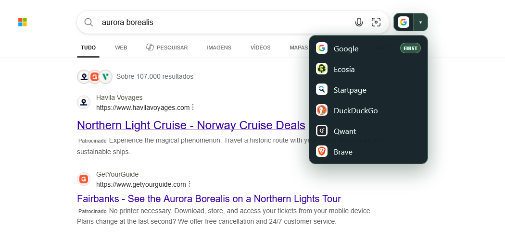

# Mozilla Firefox

<a class="install-button install-button--primary" href="https://addons.mozilla.org/en-US/firefox/addon/free-search-switcher/" target="_blank" rel="noopener">Install from Firefox Add-ons Mozilla Firefox</a>

The Firefox build uses Manifest V3 and declares Firefox **140.0 or newer on desktop** and **142.0 or newer on Android**. Desktop and Android share the same packaged extension.

## Settings and switching

On desktop, click Free Search Switcher in the browser’s extensions/toolbar controls to open its settings tab. You can also manage the extension through `about:addons`. On Firefox for Android, the action is exposed through the browser’s **Add-ons** menu.

The settings, built-in engines, custom destinations, and switching rules are shared with Chromium. There is no toolbar popup and no Firefox-only settings panel. [Read the switching guide](/usage/switching-search-engines.md).

*The packaged Firefox extension in a clean profile. The dark control and menu reflect the browser's colour preference; Bing is omitted as the current engine.*

## Why Firefox mentions search terms

The manifest includes a required `searchTerms` data declaration. Choosing a destination transfers the submitted query to that search provider in its HTTPS URL, which is the extension’s core function. The developer does not receive the query, and the extension does not store it.

This declaration is separate from the `storage` API permission and seven static search-site matches. Firefox’s prompt wording can vary by version. See [Permissions](/privacy/permissions.md), [Privacy explained](/privacy/privacy.md), and the [Privacy Policy](/privacy/privacy-policy.md).

## Firefox for Android

The interface adapts to a narrow viewport and coarse pointers with larger touch controls. Depending on the search site, switching controls can occupy a safe inline slot, a header gap, or reserved space below the search form. The menu fits within the available viewport and can open upward.

There is no mobile appearance setting. Layout and light/dark styling adapt automatically. Google’s mobile responses can use legacy Images/Videos URL parameters; the Google adapter recognises both current and legacy forms. Google may redirect a Shopping search to web results on Firefox for Android.

Check the [Firefox Add-ons listing](https://addons.mozilla.org/en-US/firefox/addon/free-search-switcher/) for availability on your Android device.

## Private windows

Firefox controls whether the extension is allowed in private windows through its add-on settings. Free Search Switcher has no separate private-window setting. If you allow it, switching still sends the submitted query to the selected provider; private mode does not change that navigation requirement.

## For contributors

The generated Firefox manifest uses module background scripts instead of Chromium’s service worker field. Build with `npm run build:firefox`; package with `npm run zip:firefox`. Temporary loading through `about:debugging` lasts until Firefox exits. See [Building and testing](/development/building.md).
