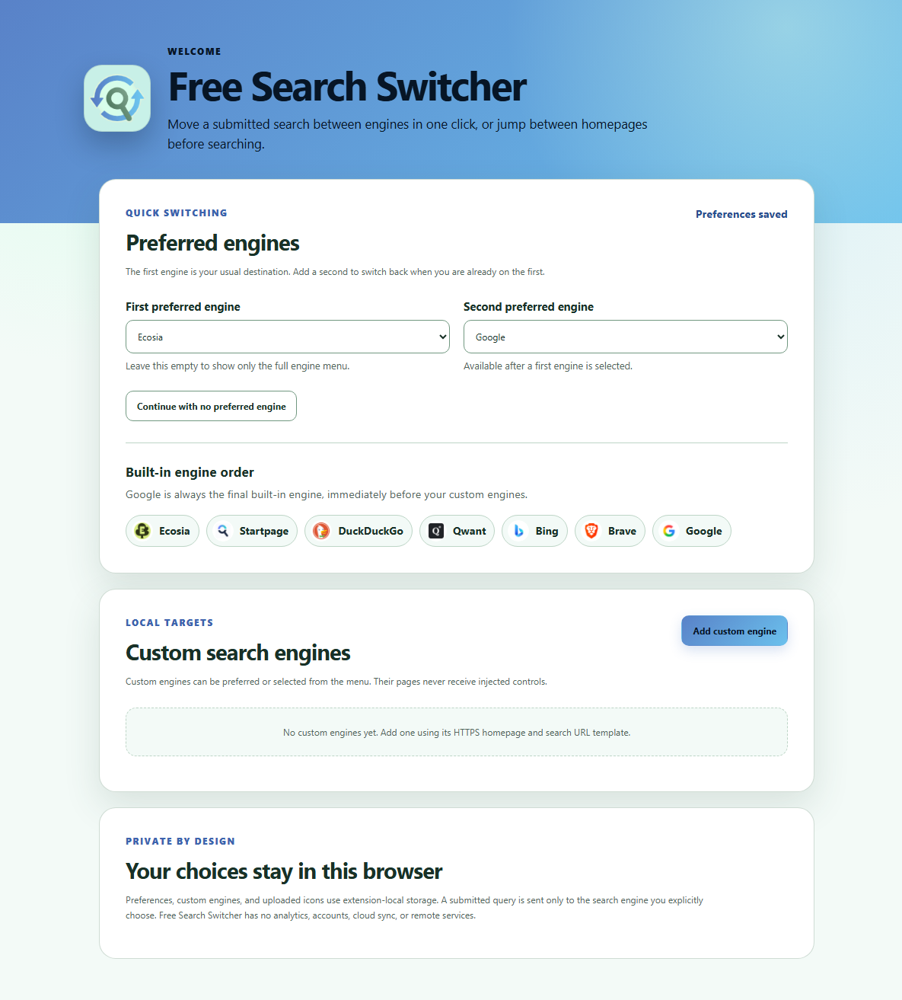
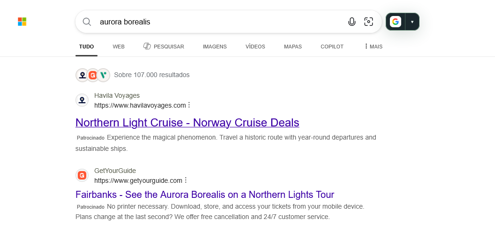

# Settings

Click Free Search Switcher's browser toolbar icon to open settings in a tab. The same page opens on the first installation; there is no separate setup wizard or account to create.

Settings work the same way in Chromium and Firefox. Preferences and custom engines are stored in extension-local storage in the current browser profile. They survive normal browser restarts and are not synchronized to other browsers or devices.

Use one settings tab at a time. An already-open settings tab can hold an older snapshot; saving from it can overwrite changes made in another settings tab. Close extra settings tabs and reload the one you keep before editing.

## Preferred engines

The **Preferred engines** section controls the quick button and the first entries in the full engine menu.

*Settings after saving Ecosia and Google as preferences. A new installation starts with neither selected.*

| Control | Default | Available values and effect |
| --- | --- | --- |
| **First preferred engine** | **No preferred engine** | Any of the seven built-in engines or a saved custom engine. Adds a quick destination on other supported engines and places it first in the menu when it is not the current engine. |
| **Second preferred engine** | **No second preferred engine**, with the selector disabled | Available after selecting a first preference. Choose another built-in or custom engine to provide a quick destination when you are on the first preference. It appears second in the menu when applicable. |
| **Continue with no preferred engine** | No action until clicked | Clears both preferences and uses only the full engine menu. Saved custom engines are retained. The settings tab stays open. |

To configure two-engine switching:

1. Choose your usual destination under **First preferred engine**, for example Ecosia.
2. Choose a different engine under **Second preferred engine**, for example Google.
3. Wait for **Preferences saved** to appear.
4. Visit either engine and use the quick button. From Ecosia it goes to Google; from Google or any other supported engine it goes to Ecosia.

Each selector saves immediately when changed. There is no separate Save button for preferences. Open supported pages update after the saved setting changes; a browser restart or page reload is not normally required.

The two preferences must differ. The first engine is unavailable in the second selector. Selecting the existing second preference as the new first clears the second slot. Clearing the first preference clears the second and disables its selector.

Preferences choose destinations; they do not change your browser's default search engine.

## Built-in engine order

The displayed catalog is a reference list:

**Ecosia → Startpage → DuckDuckGo → Qwant → Bing → Brave → Google**

Built-ins cannot be removed, disabled, edited, or reordered. In the on-page menu, preferences come first and the remaining built-ins retain this order. Google is the last remaining non-preferred built-in, followed by non-preferred custom engines in creation order. The current engine and duplicate entries are omitted.

## Custom search engines

There are no custom engines by default. **Add custom engine** opens an editor for these fields:

| Field or control | Default when adding | Purpose |
| --- | --- | --- |
| **Display name** | Empty | Required name shown in the menu and preference selectors. Up to 80 characters after trimming surrounding whitespace. |
| **Home URL** | Empty | Required HTTPS destination used when there is no submitted query. |
| **Search URL template** | Empty | Required HTTPS URL containing exactly one literal `{query}` after the hostname. Used to transfer a submitted query. |
| **Choose image** | No image | Optional local PNG, JPEG, WebP, or ICO file, maximum 2 MB. The browser fits it into a transparent 128 × 128 image while preserving its aspect ratio. |
| **Remove icon** | Disabled when no icon is selected | Removes the icon from the pending edit. Save the engine to persist the removal. Without an icon, its first letter is displayed. |
| **Save custom engine** | No action until clicked | Validates the fields and saves the new engine or changes. Successful saving closes the editor and updates menus and selectors. |
| **Cancel** or the editor's **×** button | No action until clicked | Closes the editor and discards its unsaved changes. |

Unlike preference selectors, custom-engine fields and icon changes save only when you click **Save custom engine**. Field errors keep the editor open so you can correct them.

Saved engines have **Edit** and **Delete** controls. Editing retains the engine's menu position and preferred selection. Deleting asks for confirmation and cannot be undone. Deleting your first preference clears both preferred slots; deleting your second clears only the second.

Custom engines can be preferred destinations, but adding one does not add search detection or grant access to its website. See [adding and maintaining custom engines](/configuration/search-engines.md#custom-engines) for URL examples and validation rules.

## Appearance and accessibility

The extension automatically follows the browser's light/dark color preference and supports forced-colors mode. The settings page and on-page controls adapt to narrow screens and touch input. There is no manual theme, size, color, placement, or animation setting.

*The control follows the browser's colour preference independently of the search site's appearance. This real Firefox capture shows Google as the quick destination.*

Buttons have visible keyboard focus, the engine menu supports [keyboard navigation](/usage/switching-search-engines.md#use-the-keyboard), and preference saves and validation messages are announced through accessible status or alert regions.

## Return to the default setup

To return to menu-only switching, click **Continue with no preferred engine**. To also remove custom entries, use **Delete** on each custom engine and confirm each deletion.

The extension has no full-reset, import, or export control. For details about local storage and uninstalling, read [privacy and data handling](/privacy/privacy.md) and the [Privacy Policy](/privacy/privacy-policy.md).
