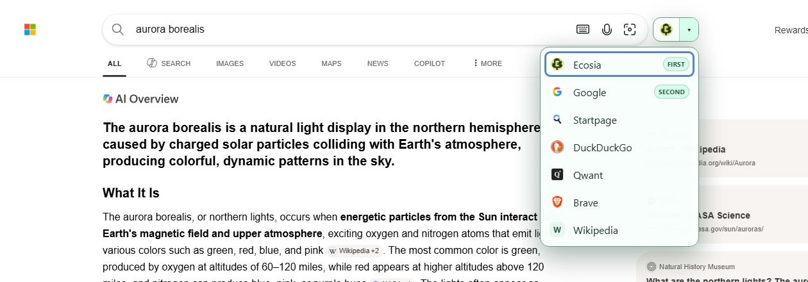

# Switching search engines

Free Search Switcher adds a small control near the search bar on its [supported search websites](/configuration/search-engines.md). Choose another engine to search for the same submitted text in the current tab.

## Move a search to another engine

1. Open a supported engine, such as [Bing](https://www.bing.com/), and submit a neutral query such as `red flowers`.
2. Find the Free Search Switcher control near the search bar. Its arrow button is labelled **Choose another search engine**.
3. Click the arrow to open the engine menu.
4. Choose a destination, such as DuckDuckGo.

The current tab navigates to the destination engine with the submitted query. You do not need to copy the text or search again manually.

The current engine is omitted from the menu. Your preferred engines appear first, marked **First** and **Second**, followed by the other built-ins and then custom engines. Each destination appears once.

*The real menu on Bing: Ecosia and Google are preferred destinations; Wikipedia is a saved custom entry. Bing is omitted because it is the current engine.*

## Use the quick button

Set a [first preferred engine](/configuration/settings.md#preferred-engines) to add its icon beside the menu arrow. Hover over the icon to see its destination, or use its accessible label, **Switch to [engine name]**. Click it to switch immediately.

The destination depends on which engine you are using:

| Your preferences | Current engine | Quick button |
| --- | --- | --- |
| None | Any supported engine | Only the menu arrow appears. |
| First only | Your first preference | Only the menu arrow appears. |
| First only | Any other supported engine | Switches to your first preference. |
| First and second | Your first preference | Switches to your second preference. |
| First and second | Any other supported engine, including your second preference | Switches to your first preference. |

For example, set Ecosia first and Google second. On Ecosia, the quick button takes you to Google; on Google, Bing, or another supported engine, it takes you to Ecosia. The arrow always provides the other available destinations.

The current engine is the detected built-in provider. A custom entry remains a separate destination even if its URL uses a built-in website; it is not detected as that page's current custom engine.

## Switch before searching

You can also switch from supported homepages. With no submitted query, the extension opens the destination's homepage.

Text typed into a search box is **not transferred until you submit it**. If you type `red flowers` on a homepage and switch immediately, the destination opens without that text. On results for `red flowers`, typing `blue flowers` without submitting still transfers `red flowers`.

This rule also applies when a website replaces its search input or updates its results without a full page reload. The extension reads the current submitted query when you select the destination.

## Preserve Images, Videos, News, Maps, or Shopping

When the source URL identifies a supported search mode, switching keeps that mode if the destination has a corresponding URL in the extension. For example, switching Bing Images results to Google opens Google Images for the same query.

If the destination has no corresponding mode, it receives a normal web search. Switching Google Maps results to Ecosia keeps the query and opens Ecosia web results. A custom engine always uses its single configured search template.

Only the query and recognized mode are transferred. Result-page number, SafeSearch, date range, region, and other provider-specific filters are omitted. The destination applies its own settings and may redirect or add parameters to the URL.

See the [mode compatibility table and provider limitations](/configuration/search-engines.md#search-mode-compatibility), including Startpage's tab handling and map pages where the control is unavailable.

When there is no query, switching opens a dedicated mode homepage if one is configured for that destination; otherwise it opens the engine's usual homepage. It does not construct an empty search.

## Use the keyboard

There is no extension-wide keyboard shortcut. The on-page controls use ordinary button interaction and provide keyboard navigation inside the engine menu.

| Key | Action |
| --- | --- |
| Tab / Shift+Tab | Move focus through the page's controls to the switcher. |
| Enter or Space on a focused button | Activate the quick button, open or close the menu, or choose a focused engine. |
| Arrow Down / Arrow Up while the menu is open | Move to the next or previous engine; navigation wraps at either end. |
| Home / End while the menu is open | Focus the first or last destination. |
| Escape while the menu is open | Close it and return focus to the arrow button. |

Opening the menu focuses its first destination. Clicking the arrow again closes it and restores focus to the arrow. Clicking or tapping elsewhere closes it without restoring focus.

## Use a narrow or touch screen

Tap the same quick button or menu arrow. Controls and menu rows become larger on narrow screens or when the browser reports a coarse pointer. The menu can scroll and opens above or below the control according to available space.

Placement adapts to the website: controls may sit inside the search row, beside it, below it, or in free header space. They follow the search bar as the layout changes. If the search bar is outside the visible viewport, the control is hidden until it comes back into view.

See [browser support](/getting-started/browser-support.md) for Firefox for Android requirements and availability.

## Open settings

Click Free Search Switcher's icon in the desktop toolbar or extensions menu to open its popup. The global switch and preferred selectors save immediately; **Open Settings** opens the full page with Save/Cancel for all configuration. On Firefox Android, the action provides simple access to full Settings. Search switching itself stays in the on-page controls.

Settings also opens automatically on the first installation. Global/site switches default on and apply when a page loads; reload after changing them. Site switches do not remove any destinations. You can leave both preferences empty and start using the menu immediately. [Configure preferences and custom engines](/configuration/settings.md).

If the control is missing or a search behaves unexpectedly, follow the [troubleshooting guide](/troubleshooting.md).
